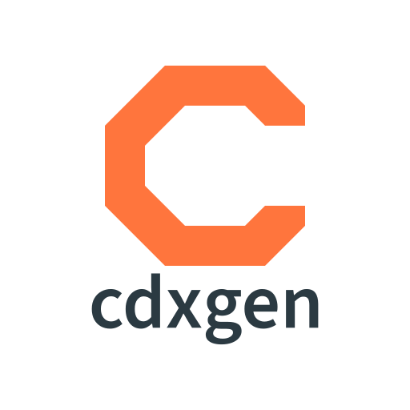

# Introduction

This repo contains binary executables that could be invoked by [cdxgen](https://github.com/cdxgen/cdxgen).



[](https://github.com/cdxgen/cdxgen)
![NPM][badge-npm]
![NPM Downloads][badge-npm-downloads]

## Usage

## Installation

Install cdxgen, which installs this plugin as an optional dependency.

```bash
sudo npm install -g @cyclonedx/cdxgen
```

cdxgen would automatically use the plugins from the global node_modules path to enrich the SBOM output for certain project types such as `docker`.

[badge-npm]: https://img.shields.io/npm/v/%40cdxgen%2Fcdxgen-plugins-bin
[badge-npm-downloads]: https://img.shields.io/npm/dm/%40cdxgen%2Fcdxgen-plugins-bin
[npmjs-cdxgen]: https://www.npmjs.com/package/@cdxgen/cdxgen-plugins-bin
