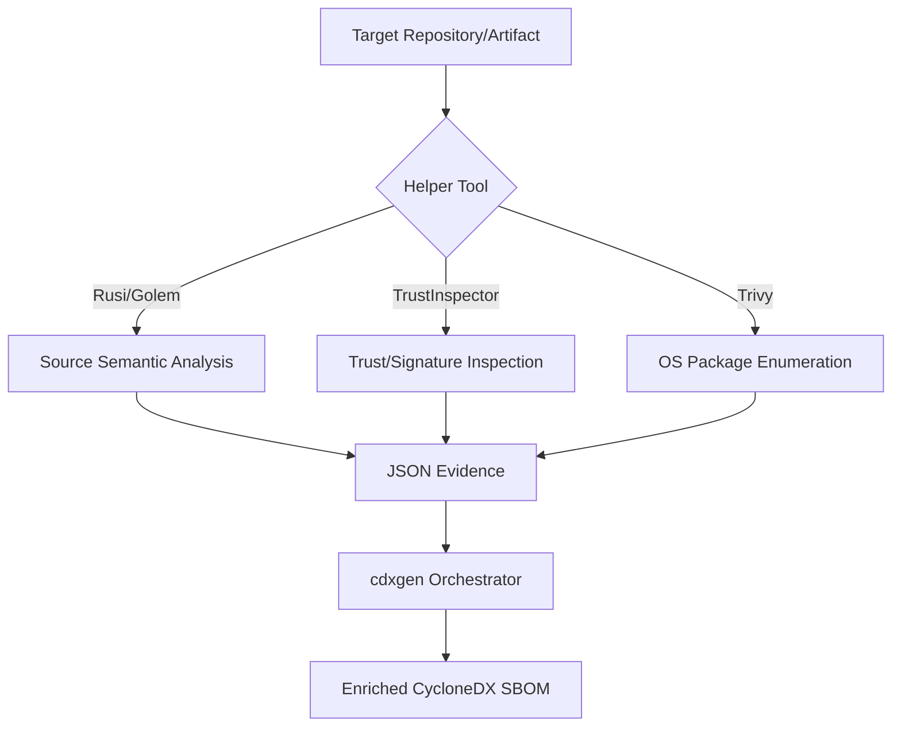

# cdxgen-plugins-bin

This repository provides a suite of specialized helper binaries designed to enrich Software Bill of Materials (SBOM) generation through deep semantic analysis and trust inspection. These tools are primarily consumed by [cdxgen](https://github.com/cdxgen/cdxgen) to provide high-fidelity evidence for security, compliance, and supply chain integrity.

## Core Purpose

Standard SBOM tools often rely on package manager metadata, which can be superficial. This project implements deep collectors that analyze the actual contents and behavior of software artifacts. By integrating these helpers, cdxgen can produce SBOMs that include:

* Cryptographic Evidence: Identification of cryptographic libraries, algorithms, and sensitive material usage (e.g., CBOM).
* Trust Posture: Verification of code-signing, notarization, and trust anchor integrity for binaries and root filesystems.
* Semantic Evidence: Call graphs and data-flow traces to map how data moves through source code.
* OS-Level Inventory: Detailed enumeration of OS packages, including provenance and installation metadata.

## Tooling Overview

The repository bundles several specialized tools. Some are wrappers around industry standards, while others are custom engines developed specifically for this ecosystem.

### Custom Analysis Engines

These tools perform deep source-level analysis and emit structured JSON evidence.

| Tool | Language | Primary Use Case | Analysis Method |
| :--- | :--- | :--- | :--- |
| **Rusi** | Rust | Rust source semantic evidence and CBOM | AST parsing and optional MIR/HIR compiler-assisted analysis |
| **Golem** | Go | Go source semantic evidence and data-flow | SSA-based taint analysis and type-resolved call graphs |
| **TrustInspector** | Cross-platform | Trust anchor and signing state inspection | Direct OS/rootfs interrogation (macOS, Windows, Linux) |

### Specialized Wrappers

These tools wrap existing capabilities to optimize them for SBOM enrichment.

* Trivy Wrapper: Optimizes [Trivy](https://github.com/aquasecurity/trivy) for container and rootfs scanning. It suppresses noise and focuses on emitting high-density CycloneDX metadata regarding OS package provenance and lifecycle.
* SourceKitten / DoSAI: Enhances Swift and .NET enrichment through language-specific semantic data.

## Technical Approach

The project follows a collector-emits-evidence architecture. Each tool is designed to be a standalone, non-interactive binary that performs a specific, bounded task and produces a stable JSON report.

### Evidence Integrity and Provenance

To ensure the integrity of the enrichment process, every bundled helper is accompanied by a provenance bundle:

* `plugins-manifest.json`: Contains per-plugin metadata, including exact versions, hashes, and the specific SBOM reference created during the build.
* `sbom-postbuild.cdx.json`: A CycloneDX inventory of the helper tools themselves.

This allows downstream consumers to verify the identity and integrity of the tools used to generate the SBOM.

## Use Cases

### 1. Cryptographic Bill of Materials (CBOM)
Security analysts can use the rusi and golem engines to automatically extract cryptographic provider usage, algorithm types, and sensitive material identifiers. This transforms a standard SBOM into a machine-readable map of a project's cryptographic surface area.

### 2. Supply Chain Trust Verification
Compliance experts can leverage trustinspector to verify that binaries in a distribution or containers in a registry are correctly signed and notarized. This enables automated auditing of trust anchors (e.g., CA stores, GPG keyrings) within deployed environments.

### 3. Deep Dependency Mapping
By using semantic call graphs, engineers can move beyond "what is installed" to "what is actually reachable." This helps in assessing the impact of a vulnerability by determining if a vulnerable function is truly part of the execution path.

## Security and Operational Considerations

### Threat Model Summary

The tools are designed with a focus on security and resource constraints.

| Risk Category | Mitigation Strategy |
| :--- | :--- |
| **Code Execution** | Tools like rusi offer a stable backend that uses AST parsing without executing code, minimizing risk when analyzing untrusted repositories. |
| **Resource Exhaustion** | Engines implement strict budgets for data-flow slices, call graph edges, and function instructions to prevent DoS via complex source code. |
| **Secret Exposure** | Analyzers are strictly prohibited from copying raw secret values (e.g., actual private keys) into reports, instead recording only identifiers and metadata. |
| **Metadata Sensitivity** | All reports are treated as potentially sensitive due to the inclusion of internal file paths and symbol names. |

### Recommended Operating Modes

* For Untrusted Repositories: Always prefer the stable backend (for Rusi/Golem) and use the Trivy wrapper for rootfs scanning. Avoid the compiler backend unless the environment is isolated.
* For High-Fidelity Audits: Use the compiler backend in isolated environments to gain access to type-resolved and MIR-informed evidence.

## Implementation Details

The repository is organized by tool provider. Each sub-directory contains the source code, tests, and specific documentation for that helper.

* `thirdparty/rusi/`: Rust Source Inspector source and evaluation harnesses.
* `thirdparty/golem/`: Go Library Evidence Mapper source.
* `thirdparty/trustinspector/`: Trust inspection logic for macOS, Windows, and Linux.
* `thirdparty/trivy/`: Optimized Trivy wrapper.
