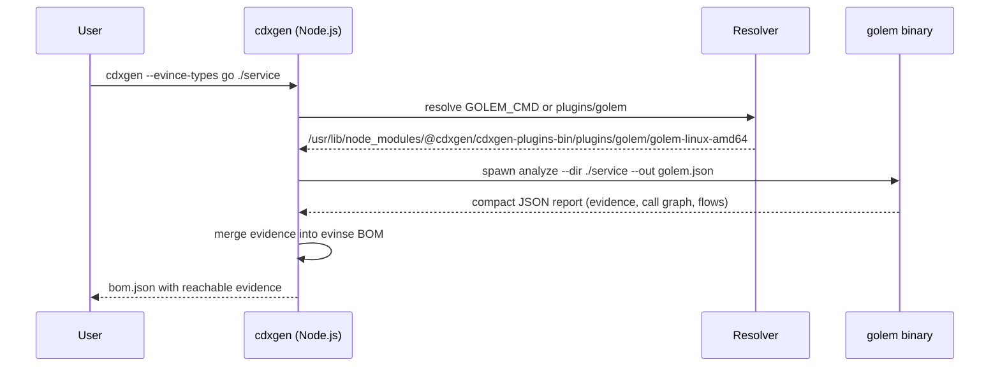
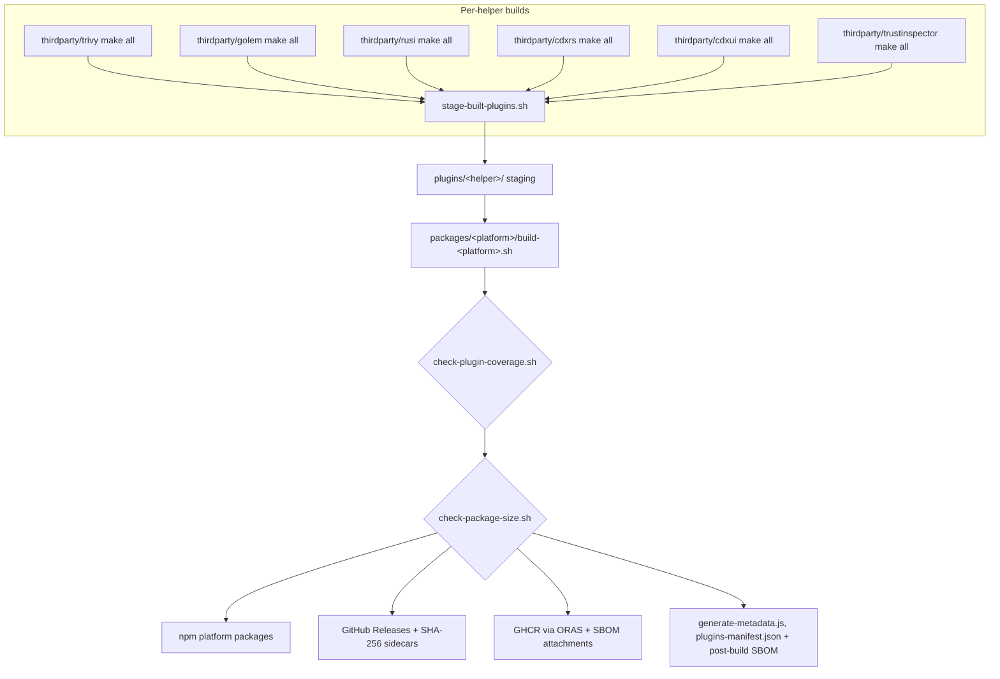

# Architecture

This repository sits one layer below cdxgen. cdxgen is a Node.js application that generates CycloneDX BOMs for a very large set of project types. Some of those project types need tools that a JavaScript runtime cannot reasonably embed: the Go type checker, Rust's `syn` parser and rustc, Apple SourceKit, .NET reflection, APK/DPKG/RPM databases, macOS `codesign`, Windows Authenticode and WDAC. This repository builds those capabilities as standalone native binaries, packages them per platform, and ships them so cdxgen can find and execute them at scan time.

## The contract

Every helper follows the same shape. It reads a project directory, an archive, or host state; it writes compact JSON (or a CycloneDX document, for trivy-cdxgen) to a file or stdout; it exits 0 on success. None of them talk to a broker, open a port, or daemonize. cdxgen spawns the binary it needs, merges the output into the BOM it is building, and moves on.

Two properties make this safe to evolve:

1. Every helper is optional at runtime. cdxgen degrades gracefully when a binary is missing, the wrong major version, or disabled by environment variable. cdxrs makes this contract explicit with a byte-identical JavaScript fallback; golem and rusi are invoked by cdxgen's evinse layer, which also works without them.
2. Helpers are data sources, not decision makers. They report evidence: symbols, flows, endpoints, trust material. Policy lives in cdxgen and in whatever consumes the BOM.

## How cdxgen finds a helper

cdxgen normalizes the runtime platform and architecture into a target tuple (with musl detection for Linux and a `.exe` extension for Windows), then resolves each helper in three steps:

1. An environment variable override, if set: `GOLEM_CMD`, `RUSI_CMD`, `CDXRS_CMD`, `CDXUI_CMD`, `TRIVY_CMD`, `DOSAI_CMD`, `OSQUERY_CMD`, `SOURCEKITTEN_CMD`, `TRUSTINSPECTOR_CMD`, `CARGO_AUDITABLE_CMD`. This is the escape hatch for custom builds and air-gapped installs.
2. A staged `plugins/` directory next to the cdxgen installation, verified by the presence of `plugins-manifest.json` or at least one known helper subdirectory.
3. The platform-specific `@cdxgen/cdxgen-plugins-bin-*` npm package, installed as an optional dependency of cdxgen, which contains the same staged layout for the current tuple.



If resolution finds nothing, cdxgen continues without deep evidence. If the binary crashes, the scan degrades rather than fails. That trade is deliberate: an SBOM without reachable evidence is still useful, a crashed scan is not.

## Repository layout

```
cdxgen-plugins-bin/
├── index.js                  # entry point; cdxgen loads the package to check versions
├── package.json              # @cdxgen/cdxgen-plugins-bin, published to npm
├── build.sh                  # orchestrates a full local build for every platform
├── thirdparty/               # source (or pinned upstream source) for each helper
│   ├── golem/                # Go analyzer, own module, tests, and docs
│   ├── rusi/                 # Rust analyzer workspace
│   ├── cdxrs/                # Rust BOM validation and fetch
│   ├── cdxui/                # Rust terminal UI
│   ├── trustinspector/       # Go trust inspector
│   ├── trivy/                # pinned trivy fork with a cdxgen-oriented main
│   └── sourcekitten/         # build script over the upstream SourceKitten release
├── plugins/                  # staging area: build/<helper> output lands here
├── packages/<platform>/      # per-platform packaging scripts and npm payload
│   ├── linux-amd64/
│   ├── darwin-arm64/
│   └── ...
└── scripts/                  # staging, coverage, size, metadata, and publish tooling
    ├── stage-built-plugins.sh
    ├── check-plugin-coverage.sh
    ├── check-package-size.sh
    ├── generate-metadata.js
    └── publish-helper-oras.sh
```

Helpers whose upstream lives elsewhere (trivy, sourcekitten, dosai, osquery) are either thin forks with a replaced `main` (trivy) or downloaded and repackaged release artifacts (sourcekitten, dosai, osquery). The custom helpers (golem, rusi, cdxui, cdxrs, trustinspector) live here in full and carry their own tests, docs, and threat models.

## Build and packaging pipeline

`build.sh` runs the whole train locally; CI runs the same steps through the workflows in `.github/workflows`. The order matters: coverage is checked before size, because a package that is small but missing golem is the worse outcome.



Each `thirdparty/<helper>` directory has a Makefile (or shell script) that cross-compiles the helper for every supported tuple into `build/`, produces a `.sha256` sidecar next to each binary, and, where the toolchain allows, attaches a CycloneDX SBOM of the binary itself.

## Provenance bundle

Each staged `plugins/` directory ships with two metadata files produced by `scripts/generate-metadata.js`:

- `sbom-postbuild.cdx.json`, a post-build CycloneDX inventory of the bundled helpers
- `plugins-manifest.json`, a provenance bundle with the generated-at timestamp, package identity, and per-helper component metadata: purl, version, hash, binary path, and SBOM reference

cdxgen reads the manifest when present so the generated BOM can record precise helper identity under `metadata.tools`. The manifest is data only. Nothing in it is executed; cdxgen parses it as JSON and uses it to tighten attribution.

## Distribution channels

| Channel         | Artifact                                            | Consumer                       |
| --------------- | --------------------------------------------------- | ------------------------------ |
| npm             | `@cdxgen/cdxgen-plugins-bin` plus per-platform pkgs | cdxgen's optional dependencies |
| GitHub Releases | raw binaries with `.sha256` sidecars                | scripts, air-gapped installs   |
| GHCR via ORAS   | one tag per binary, plus SBOM and checksum files    | `oras pull` in CI and images   |

cdxgen pins cdxrs by major version and logs once before falling back to JavaScript on a mismatch, so when a cdxrs release changes the major, the plugins release must land first.

## When to add a helper here

The bar is simple: the capability must require a native toolchain or OS API that Node.js cannot reach, and the output must be stable, compact JSON that merges cleanly into a CycloneDX document. Anything that is only string processing belongs in cdxgen itself. New custom helpers land under `thirdparty/` with a Makefile, per-platform build targets, tests, a README that explains what the tool will not report, and an entry in the staging and coverage scripts.
