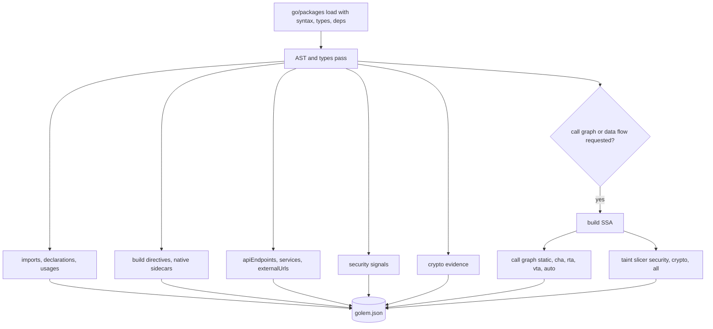

# golem: Go Library Evidence Mapper

golem is a static analyzer for Go source trees. It loads a module or workspace with the real Go toolchain, resolves types, builds SSA when asked, and writes a compact JSON report describing code structure, dependencies, call relationships, API endpoints, cryptographic use, and selected data flows.

The design goal is evidence collection, not exploit proof. Reports stay small and reviewable: symbols, source locations, package context, graph edges, classifications, and counts. Raw secrets, file contents, and command output are never copied into the report.

## Installation

golem ships as a binary named `golem-<platform-tuple>` in this repository's packages. cdxgen resolves it automatically for Go evinse scans; you can also point `GOLEM_CMD` at your own build:

```bash
cd thirdparty/golem
go build -o /usr/local/bin/golem ./cmd/golem
export GOLEM_CMD=/usr/local/bin/golem
```

Building golem requires Go 1.27 or later. The version that builds golem is also the newest language version it can type-check, since `go/types` applies the rules of its own release. A module declaring a newer `go` directive gets a `go-version` diagnostic in the report rather than a silent cascade of fake type errors.

## First report

```bash
golem analyze --dir /path/to/go/project --out golem.json
```

Useful variants:

```bash
golem analyze --dir . --callgraph static --format graphml --out callgraph.graphml
golem analyze --dir . --callgraph rta --dataflow security --out golem.json
golem analyze --dir . --tags prod,linux --tests --out golem.json
golem analyze --dir . --roots exported --out library.json
```

The default package pattern is `./...`. When `--dir` has no `go.mod` or `go.work`, golem discovers child modules and merges results; `--no-recurse` turns that off.

## What one analysis pass produces



The report schema is versioned and documented field by field in [JSON_ATTRIBUTE_REFERENCE.md](https://github.com/cdxgen/cdxgen-plugins-bin/blob/main/thirdparty/golem/JSON_ATTRIBUTE_REFERENCE.md) in `thirdparty/golem`.

## Call graphs

| Mode   | Implementation   | Practical behavior                                                              |
| ------ | ---------------- | ------------------------------------------------------------------------------- |
| none   | no graph         | fastest; source evidence only                                                   |
| static | static.CallGraph | fast and deterministic; direct calls only                                       |
| cha    | cha.CallGraph    | conservative for interface dispatch; more edges                                 |
| rta    | rta.Analyze      | roots-driven reachability; useful for executables                               |
| vta    | vta.CallGraph    | variable type analysis over the reachable set; often the most precise           |
| auto   | CHA to RTA to VTA| iterates down the chain on timeout; records which algorithm ran in diagnostics  |

Two ideas matter when you read golem graphs.

Root selection decides what "reachable" means. `main` (the default) also seeds `init` and type-resolved framework registrations. `exported` is what makes a library analyzable: without it, a module with no `main` yields almost nothing because nothing is reachable. `handlers` seeds every detected HTTP handler, and `symbol:<regex>` seeds anything matching a pattern.

Filtering is a view, not an opinion. Stdlib and local-module exclusions are applied after reachability was computed on the complete graph. A path that runs through omitted code is preserved as one `collapsed` edge that records the hop count and the packages traversed, so a handler invoked through `net/http` still has an edge from the code that registered it. `--dependency-detail` controls the same idea for dependency interiors: `collapse` (default), `drop`, or `full` (`--include-all-flows` is an alias).

`callGraph.reachability` reports, per node, whether any root reaches it, the shortest distance, and which roots. `--reachable-symbols <file>` adds shortest witness paths for named symbols, capped by `--max-paths-per-symbol`.

## Data flow

```bash
golem analyze --dir . --dataflow security --dataflow-graph-out flows.graphml --out golem.json
```

Modes: `security` tracks input-to-execution and input-to-response style flows; `crypto` tracks key material into crypto APIs; `all` adds third-party module cache paths. Data flow uses the call graph when `--dataflow-callgraph` is not `none`, indexing dynamic callees by call site and replaying method summaries through them. Custom sources, sinks, passthroughs, and sanitizers merge with the built-in rules through `--dataflow-patterns <file>`, and `--dataflow-pattern-packs` selects among the built-in families (http, crypto, filesystem, process, and friends).

## API endpoints

Endpoint detection walks registration calls, so a Gin, chi, Echo, fiber, iris, or net/http service yields `apiEndpoints[]` records with framework, method, composed path, handler, package, and usage scope. Group prefixes are composed the way the frameworks compose them, including the group-root idiom `users.GET("", listUsers)`, which resolves to `/api/v1/users` instead of being dropped as pathless. Listeners such as `http.ListenAndServe` are recorded separately as `http-listener` records, and gRPC-style registrations as `rpc-service`.

On top of the route table, golem walks each handler body to recover signatures: path and query parameters from helpers like `c.Param("id")`, `chi.URLParam(r, "id")`, `r.PathValue("id")` and `r.URL.Query().Get("q")`; request body types from `c.ShouldBindJSON(&x)`, `render.DecodeJSON(r.Body, &x)`, or `json.NewDecoder(r.Body).Decode(&x)`; response types from `c.JSON(200, User{})`, `render.JSON(w, r, expr)`, or `json.NewEncoder(w).Encode(expr)`.

Three rules keep the output honest. Matching works on resolved package paths and parameter types, so `g "github.com/gin-gonic/gin"` aliases and a context parameter named `ctx` both work, and versioned module paths like `github.com/go-chi/chi/v5` match their unversioned spelling. Handlers can be named functions, method expressions, or inline func literals at the registration site. When a pattern cannot be matched with confidence, the field stays empty: a handler whose short name is declared twice in the package, on different receiver types, is left unenriched rather than enriched from the wrong body. A 4xx/5xx payload is stored as an error shape and only becomes `responseType` when the handler never emits a successful response.

`services[]` rolls endpoints up per framework, and `externalUrls[]` inventories literal URLs in source for egress review.

## Cryptographic evidence

The AST and types pass classifies crypto imports into families, resolves selector expressions like `crypto/md5.Sum` or `crypto/tls.LoadX509KeyPair` through type information, flags `InsecureSkipVerify: true` as a critical finding, and detects string literals bound to names that look like key material without copying the literal. The `crypto` section emits `libraries`, `assets`, `operations`, `materials`, `protocols`, and `findings`, with a `confidence` field separating type-resolved evidence from name-based indicators.

This is a finding aid for CBOM work. It is strong on direct use of known Go crypto APIs and weak primitives, and intentionally weak on custom wrappers, reflection-heavy code, and questions about key lifetime.

## Output formats

`json` is the full report. `graphml` and `gexf` export the call graph and require a call graph mode. Data-flow sidecars are written with `--dataflow-graph-out` in graphml or gexf.

## What golem will not tell you

It will not prove an exploit, verify a TLS configuration end to end, validate a protocol state machine, or analyze a module whose `go` directive exceeds its build toolchain. Those limits are stated in the README and in the report diagnostics where possible.
