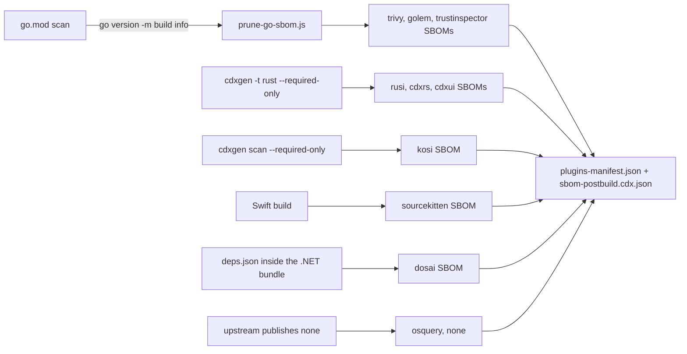

# Lesson 10: Where each helper's own SBOM comes from

## Learning objective

Build and read the provenance bundle this repository ships beside its binaries: understand, per helper, where its SBOM is derived from, why that derivation is the honest one for that toolchain, and which gates keep the bundle from lying.

## Pre-requisites

- [Lesson 7](LESSON7.md), a full `./build.sh` or at least one helper built and staged
- cdxgen installed (`npm install -g @cdxgen/cdxgen`), since the Rust and Kotlin SBOMs are cdxgen scans

## The question the bundle answers

This repository tells consumers what is inside the programs it ships, which means an SBOM of each helper itself, not of anything a helper analyzes. The naive answer, "scan the source tree", is wrong in a different way for each toolchain, and the interesting part of the pipeline is how each family gets its honest answer.



## The Go family: the manifest that overstates

A `go.mod` lists every module in the build graph, but a slim binary links far less of it. The trivy fork vendors all of upstream Trivy and cuts most of it out at build time through overlays and patches, so its `go.mod` names about four times the modules the shipped binary contains: 371 against 96. An SBOM read off `go.mod` claims vulnerabilities in code that is not in the binary.

The build info every Go binary embeds is the exact list. `scripts/prune-go-sbom.js` takes a cdxgen scan and one or more binaries, reads each binary's build info with `go version -m`, keeps the components it names, adds any it names that the scan missed, records the Go standard library the binary was built with, and rewires the dependency graph around the modules it drops:

```bash
cd thirdparty/trivy && make sbom
# runs: cdxgen -t go -o build/sbom-trivy-postbuild.cdx.json
#   and: node ../../scripts/prune-go-sbom.js build/sbom-trivy-postbuild.cdx.json build/trivy-cdxgen-*
```

Two details in the script are load-bearing. A UPX-packed binary hides its build info, so the SBOM must be generated before compression, and the script skips such a binary with a warning rather than silently pruning against nothing. And a binary built from other module versions than `go.mod` requires, a stale one left in `build/`, is skipped too, because its build info describes a different program.

## The Rust and Kotlin family: keep the kitchen out

rusi, cdxrs, cdxui and kosi are scanned with cdxgen itself, restricted to what ships:

```bash
cd thirdparty/rusi && make sbom
# runs: cdxgen -t rust --required-only --exclude "fixtures/**" -o build/sbom-rusi-postbuild.cdx.json
```

`--required-only` leaves out the dependencies cdxgen marks as development or test, and the exclusion keeps fixtures out. Both flags exist because each was once missing: rusi's SBOM listed its 46 fixture crates, and kosi's listed its example app, its test dependencies, and Gradle modules at version "latest". A test fixture is not in the binary, and "latest" is not a version.

## dosai: read it out of the binary

dosai is downloaded as a published release that ships no SBOM, so there is no source tree to scan honestly. But a .NET single-file bundle carries the dependency manifest the host loads the application with: every NuGet package in the binary, its version, its SHA-512, and the edges between them. `scripts/generate-metadata.js` reads the `deps.json` out of the bundle (the script's reader lives in `scripts/dotnet-bundle-sbom.js`) and writes the SBOM from it during metadata generation. The lesson generalizes: when a tool ships no inventory but embeds one, the embedded one beats a guess.

## osquery: say none

osquery's upstream release publishes no SBOM, and which of its bundled libraries a platform's build contains depends on its CMake options, so the bundle records no SBOM for it rather than deriving one that could not be trusted. A provenance document that omits a fact silently trains its readers not to check; here the omission is stated in the repository's docs and README.

## The bundle and its gates

`plugins-manifest.json` names, per helper, the purl, version, hash, binary path and SBOM file, and `sbom-postbuild.cdx.json` merges every helper's SBOM into one inventory. Reading it is the fastest health check:

```bash
node scripts/generate-metadata.js ./plugins
jq -r '.plugins[] | [.name, .version, .sbomFile] | @tsv' plugins/plugins-manifest.json
jq '.components | length' plugins/sbom-postbuild.cdx.json
```

Each failure mode below was shipped at least once, and each is now impossible or gated:

- cdxrs and cdxui were staged into every package but missing from the manifest's tool list, so the inventory silently omitted two helpers. The tool list is derived, not hand-maintained, and a staged helper with no manifest entry is a gap to close, not a state to keep.
- The packages npmignored trivy's and sourcekitten's SBOMs while the manifest's `sbomFile` still named them: a manifest that points at a file the consumer did not receive. Every helper SBOM ships now.
- kosi's fifteen Gradle modules were dangling references in the inventory. A multi-module helper lists its modules under `metadata.component` with graph edges to them, so the inventory describes the tree it claims to.
- rusi, cdxrs and cdxui share crates, and cargo also lists the tool's own crate, which the manifest's component already stands for. A CycloneDX document may list each `bom-ref` once, so the merge dedupes rather than duplicating.

The packaging gates carry two more provenance-adjacent checks. A helper shipped without an execute bit is as absent as a missing one, since oras writes pulled files as 0644 and npm packs the mode it finds, so the coverage gate fails any package that does that. And sourcekitten, which links the Swift runtime of the toolchain that built it, fails the same gate on any non-macOS package, because Linux Swift has no stable ABI and such a binary only runs next to its exact build toolchain.

## What you learned

- an SBOM of a binary is derived from what the binary itself proves: embedded build info, bundled manifests, or a scan restricted to shipped dependencies
- a go.mod overstates a slim binary, a source scan drags in fixtures and dev dependencies, and both directions of error are provenance defects
- when no honest derivation exists, ship none and say so, the way osquery does
- the manifest and inventory are gated artifacts, and each gate corresponds to a bundle that once lied
