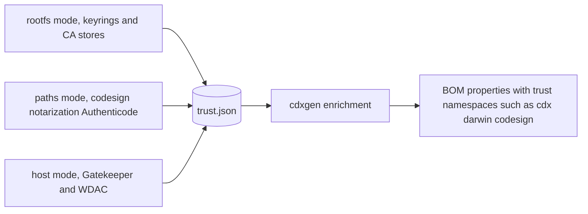

# Lesson 6: Trust posture with trustinspector

## Learning objective

Inspect the trust surface of a container rootfs and of signed binaries with trustinspector, read its three-part JSON, and understand where cdxgen puts the findings in a BOM.

## Pre-requisites

- trustinspector built:

```bash
cd thirdparty/trustinspector
make all   # or: go build -o /tmp/trustinspector-cdxgen .
```

- an unpacked container image to inspect:

```bash
mkdir -p /tmp/rootfs
docker export $(docker create alpine:latest) | tar -C /tmp/rootfs -xf -
```

## Why trust anchors belong in a BOM

A container image ships more than packages. It ships the keyrings and CA stores its processes will trust at runtime, and the signing state of the binaries it will execute. An image with a stale CA bundle, an extra keyring, or an SHA-1 signed intermediate has a supply-chain surface that no package list will show. trustinspector makes that surface visible as structured evidence.



## Inspect a rootfs

```bash
trustinspector-cdxgen rootfs /tmp/rootfs > /tmp/trust.json
jq '.materials | length' /tmp/trust.json
jq -r '.materials[] | [.type, .path] | @tsv' /tmp/trust.json | head
```

The scan walks system keyring files such as `/usr/share/keyrings`, CA stores such as `/etc/ssl/certs/ca-certificates.crt`, and private keyrings in user directories. Each material record carries SHA-1 and SHA-256 fingerprints, algorithm and key strength, and trust domain metadata. Two records of interest on a minimal Alpine image: the `alpine-keys` public keyring and the CA certificate bundle.

The fingerprints are the point. A CA bundle is boring; a CA bundle whose SHA-256 changed between two builds of the same tag is a story, and fingerprint records are what let you tell it.

## Inspect signed binaries

On a macOS machine:

```bash
trustinspector-cdxgen paths /Applications/Some.app > /tmp/signing.json
jq '.inspections' /tmp/signing.json
```

The inspection records codesigning and notarization state with properties in the `cdx:darwin:codesign:*` and `cdx:darwin:notarization:*` namespaces. On Windows, the same mode reads Authenticode signatures and OS binary status into `cdx:windows:authenticode:*`. On Linux, `paths` findings are naturally sparse; the mode exists for the platforms where it answers a real question.

## Inspect the host

```bash
trustinspector-cdxgen host > /tmp/host.json
jq '.hostFindings' /tmp/host.json
```

macOS reports Gatekeeper posture. Windows reports active WDAC policies, including the policy count under `cdx:windows:wdac:activePolicyCount`. This is the mode behind cdxgen's host-level scans, where the question is what the machine that built or runs the artifact would actually accept.

## Where the data goes

Run through cdxgen, the findings stop being a sidecar file and become properties on the BOM: rootfs materials enrich container components, signing inspections attach to the components those paths belong to, and host findings land in metadata. The JSON is intentionally merge-friendly and data only; cdxgen parses it and never executes anything from it.

If you build your own pipeline instead, the shape is simple: one JSON object, three optional keys (`materials`, `inspections`, `hostFindings`), stable property namespaces. Point a custom build at cdxgen with `TRUSTINSPECTOR_CMD`.

## What trustinspector will not do

It reports what trust material exists and what signatures say. It does not pin repositories, validate a chain against a policy you did not give it, or decide whether a WDAC policy is any good. Judgment lives in your pipeline; evidence lives here.

Next: [Lesson 7, build, package, and publish the binaries](LESSON7.md).
