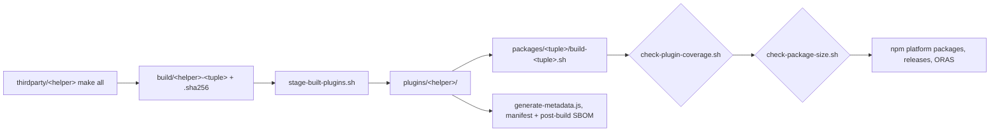

# Lesson 7: Build, package, and publish the binaries

## Learning objective

Build every helper locally, understand the staging and packaging pipeline, run the coverage and size gates in the order CI runs them, and publish a single helper to GHCR with ORAS.

## Pre-requisites

- Go 1.27+, Rust stable, Node.js 20+
- upx for the trivy compression step (optional but used by `build.sh`)
- oras CLI for the publishing section

## The pipeline in one picture



## Build one helper

Each custom helper is self-contained:

```bash
cd thirdparty/golem && make all && ls build/
```

The convention every Makefile follows is `build/<helper>-<tuple>` with a `.sha256` sidecar per binary. Tuples look like `linux-amd64`, `linuxmusl-arm64`, `darwin-arm64`, `windows-amd64`. If a tuple is missing from `build/`, the usual cause is a missing Rust cross target: `rustup target add <tuple>`. Go cross-compiles out of the box.

## Build everything

From the repository root:

```bash
./build.sh
```

This cleans `plugins/<helper>`, runs each helper's build, compresses the trivy amd64 binary, assembles every platform package under `packages/`, and then runs the two gates. Note the order the script enforces, because it is a statement about which failure is worse:

1. `check-plugin-coverage.sh` verifies each platform package contains every binary that platform promises. A package can be perfectly sized and still be missing golem; that is the outcome this gate exists to catch.
2. `check-package-size.sh` enforces the npm size ceilings. It runs second because size failures are easy to reason about once you know the package is complete.

## Staging and provenance

Look inside a staged directory after a build:

```bash
ls plugins/golem/
cat plugins/plugins-manifest.json | jq '.components[0]'
```

Alongside the binaries, `scripts/generate-metadata.js` produces the provenance bundle. `sbom-postbuild.cdx.json` is a CycloneDX inventory of the helpers. `plugins-manifest.json` records the generated-at timestamp, package identity, and per-helper purl, version, hash, binary path, and SBOM reference. cdxgen reads this manifest to attribute helper identity precisely under `metadata.tools` in the BOMs it generates.

The manifest is data only. cdxgen parses it, never executes from it. Regenerate it without a rebuild:

```bash
node scripts/generate-metadata.js
```

## The gates

Run them the way CI does, coverage first:

```bash
bash scripts/check-plugin-coverage.sh packages/linux-amd64 packages/darwin-arm64
bash scripts/check-package-size.sh packages/linux-amd64 packages/darwin-arm64
```

When size fails right after you added a helper, check coverage output first. New coverage often explains the delta, and the fix is usually a size ceiling bump with a link to the coverage change, not a smaller binary.

## Publishing one helper to GHCR

Individual binaries ship to GitHub Container Registry as ORAS artifacts, one tag per binary, with checksum and SBOM attachments where built:

```bash
bash scripts/publish-helper-oras.sh golem linux-amd64
oras manifest show ghcr.io/cdxgen/cdxgen-plugins-bin:golem-linux-amd64 | jq
```

A consumer pulls it without npm:

```bash
oras pull ghcr.io/cdxgen/cdxgen-plugins-bin:golem-linux-amd64
sha256sum -c golem-linux-amd64.sha256
```

## Release order, and why

cdxgen pins cdxrs by major version. On a mismatch its bridge logs once and uses the JavaScript fallback; nothing fails. The silent fallback is only safe because it is byte-identical, tested in cdxgen's golden test. The operational consequence: when a cdxrs major changes, publish this repository's packages first, then release cdxgen. Reversing the order produces no error anywhere, just slower scans and one log line nobody greps for.

## What you learned

- every helper follows the same build convention, so one staging script and one packaging loop serve all of them
- coverage is checked before size because a complete-but-large package beats a small-but-hollow one
- the provenance bundle is data only, and cdxgen uses it for attribution, not execution
- the only release-order constraint in the repository comes from the silent fallback contract
