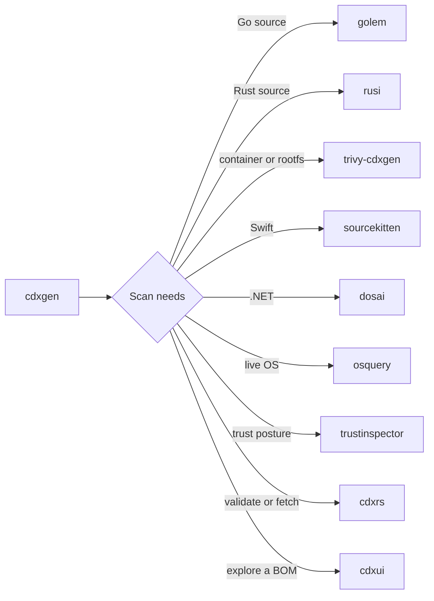

# cdxgen-plugins-bin

cdxgen is a Node.js application that generates CycloneDX BOMs for a very large set of project types. A JavaScript runtime cannot reasonably embed the Go type checker, Rust's `syn` parser and rustc, Apple SourceKit, .NET reflection, the APK, DPKG, and RPM package databases, macOS `codesign`, Windows Authenticode and WDAC, or live operating system state. This repository builds each of those capabilities as a standalone native binary, packages them per platform, and ships them so cdxgen can find and execute them at scan time.



Nine helpers, one contract: take a project directory, an archive, or host state; return compact JSON or a CycloneDX document; exit. None of them open ports or daemonize. Every helper is optional at runtime, and cdxgen degrades gracefully when one is missing, disabled, or the wrong version. The [architecture page](ARCHITECTURE.md) describes the resolution order, the provenance manifest, and the packaging pipeline in detail.

## Installation

You normally never install this package directly. Install cdxgen, and it pulls in the platform package as an optional dependency:

```bash
npm install -g @cyclonedx/cdxgen
```

When a scan reaches a project type that needs a helper, cdxgen resolves the binary and merges its output into the BOM. To use your own build of any helper, point its environment variable at it, for example `GOLEM_CMD`, `RUSI_CMD`, `CDXRS_CMD`, or `TRUSTINSPECTOR_CMD`. The full list is on the [architecture page](ARCHITECTURE.md).

## Tool guides

Every helper has its own page covering what it does, how cdxgen invokes it, direct usage, output shape, and stated limits.

| Helper                                       | Language | Guide                                  |
| -------------------------------------------- | -------- | -------------------------------------- |
| golem, the Go Library Evidence Mapper        | Go       | [GOLEM.md](GOLEM.md)                   |
| rusi, the Rust Source Inspector              | Rust     | [RUSI.md](RUSI.md)                     |
| cdxrs, BOM validation and registry fetch     | Rust     | [CDXRS.md](CDXRS.md)                   |
| cdxui, the terminal BOM explorer             | Rust     | [CDXUI.md](CDXUI.md)                   |
| trustinspector, trust posture inspection     | Go       | [TRUSTINSPECTOR.md](TRUSTINSPECTOR.md) |
| trivy-cdxgen, container and rootfs inventory | Go       | [TRIVY.md](TRIVY.md)                   |
| sourcekitten, Swift semantics via SourceKit  | Swift    | [SOURCEKITTEN.md](SOURCEKITTEN.md)     |
| dosai, .NET source and assembly inspection   | C#       | [DOSAI.md](DOSAI.md)                   |
| osquery, live OS instrumentation             | C++      | [OSQUERY.md](OSQUERY.md)               |

The [upstream helpers overview](HELPERS.md) explains why trivy is a fork while sourcekitten, dosai, and osquery are repackaged releases, and what that means for provenance.

## Which helper does what

If you are deciding where to look first, the helpers fall into four groups.

**Deep source analysis.** golem and rusi load a real toolchain or parser, resolve types, and report the kind of evidence a reviewer cannot get from a manifest file: type-resolved library usage, call graphs with reachability, source-to-sink data flows, HTTP endpoint tables, and a cryptographic inventory suitable for CBOM work.

**Fast paths on the BOM itself.** cdxrs accelerates BOM validation and registry metadata fetch inside cdxgen, and cdxui turns a finished BOM into something a human can browse, search, and present.

**Inventory from outside the source tree.** trivy-cdxgen reads container images and unpacked root filesystems for OS packages, sourcekitten and dosai bring Swift and .NET semantics to cdxgen, osquery queries the live operating system, and trustinspector reports trust anchors and code-signing state.

## Use cases

In software supply chain security work, the combination of container OS packages from trivy-cdxgen, host data from osquery, and language evidence from golem and rusi gives a layered view of composition: what the image ships, what the host runs, and what the code actually uses.

For cryptographic compliance, golem and rusi classify crypto libraries, flag weak primitives such as MD5 and SHA-1, detect TLS misconfigurations like `InsecureSkipVerify`, and report key material indicators, which makes CBOM generation a byproduct of a normal scan rather than a separate audit.

For regulatory work under NIST SSDF or the EU Cyber Resilience Act, trustinspector supplies evidence of signing policies, certificate authority trust anchors, and host posture, the kind of artifact compliance teams are asked to produce.

## Learn more

The [lessons](LESSON1.md) are hands-on and sequential: a first golem report, call graphs and data flow, Rust evidence with rusi, exploring BOMs in cdxui, validating with cdxrs, trust posture with trustinspector, and a full build-and-publish walkthrough. The [build reference](BUILD.md) covers prerequisites, per-helper builds, staging, and the three publishing channels.
