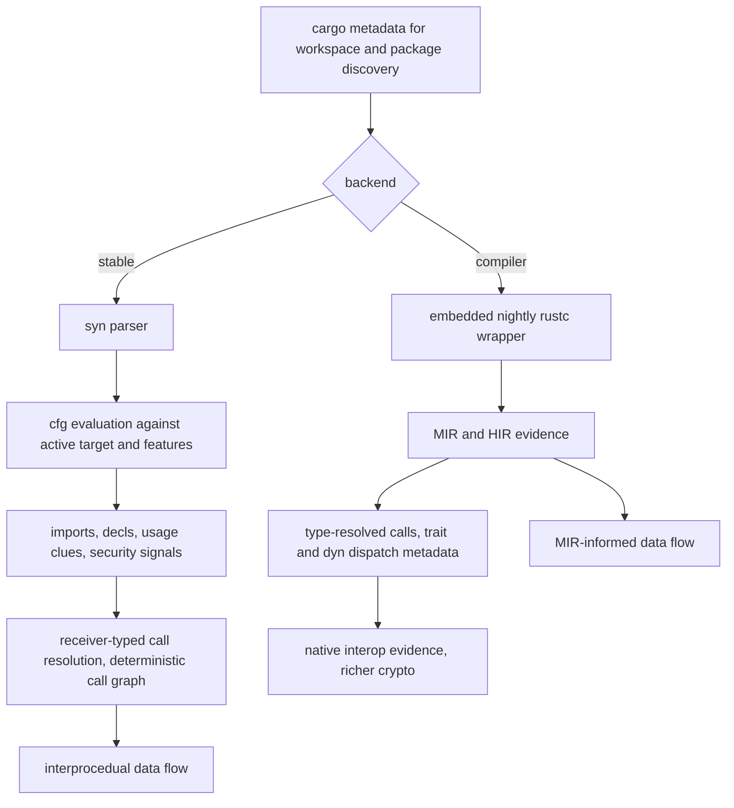

# rusi: Rust Source Inspector

rusi analyzes Rust repositories and emits semantic evidence: packages, files, symbols, imports, security-sensitive API use, a call graph, cryptographic inventory, and practical source-to-sink flows. It is the Rust counterpart to golem, and it feeds cdxgen's Rust evinse output the same way.

## Installation

rusi ships as `rusi-<platform-tuple>` in this repository's packages. To drive it yourself, build from source:

```bash
cd thirdparty/rusi
cargo build --release -p rusi-cli
target/release/rusi analyze --dir /path/to/rust/project --out rusi.json
```

## Quick start

```bash
rusi analyze --dir . --out rusi.json
rusi analyze --dir . --backend stable --callgraph static --dataflow security --out rusi-stable.json
rusi analyze --dir . --backend compiler --toolchain nightly --out rusi-compiler.json
rusi analyze --dir . --callgraph static --callgraph-out callgraph.graphml --callgraph-export-format graphml --out rusi.json
rusi cryptos --dir . --callgraph static --dataflow security --out rusi-cryptos.json
```

Output JSON is minified by default; pass `--pretty` while exploring.

## Two backends, two levels of truth



The stable backend needs no toolchain beyond a checkout. It follows `mod` declarations from each crate root, honors `#[path]` and inline modules, and evaluates `#[cfg]` against the active target and the features Cargo resolved, so code excluded from this build is not reported and conditional code carries its gate in `cfg_gate`.

Its call resolution is receiver-typed. A call on a known receiver type with no matching local impl is treated as external rather than fanned out to every same-named method, and sink matching uses the receiver type where a bare method name would be ambiguous: `Command::new(..).arg(tainted)` is a process-execution sink, another builder's `arg` is not.

The compiler backend adds an embedded nightly rustc wrapper and MIR/HIR-derived evidence: type-resolved call edges, dispatch metadata for traits and `dyn`, native interop evidence, richer crypto attribution, and MIR-informed flow facts. It trades setup cost for precision.

## Data flow and custom patterns

Flows track environment, CLI, file, and HTTP sources into process execution, filesystem write or delete, network, SQL, and HTML-response sinks. The `security` pack is built in; `--deps` extends analysis into dependency crates, and `--dataflow security-deps` keeps dependency bodies so taint can flow through them:

```bash
rusi analyze --dir . --deps --dataflow security-deps --out rusi-deps-taint.json
```

House analysis rules merge with the built-in pack through `--patterns`:

```json
{
  "sources": [
    { "pattern": "mycrate::config::read_key", "category": "custom-source" }
  ],
  "sinks": [
    {
      "pattern": "mycrate::shell::run",
      "category": "custom-command",
      "relevant_arguments": [0]
    }
  ]
}
```

```bash
rusi analyze --dir . --dataflow security --patterns ./rusi-patterns.json --out rusi-custom.json
```

## Crypto inventory

`rusi cryptos` filters the report down to cryptographic evidence for CBOM-style review. Recognized families include sha2, sha1, md5, blake3, aes-gcm, chacha20poly1305, hmac, pbkdf2, argon2, rsa, ed25519-dalek, rustls, and jsonwebtoken. The compiler backend enriches these with type-resolved call sites where the toolchain evidence allows.

## Fan-out control

Call graph construction caps per-call-site candidates to keep pathological dispatch sites from exploding the graph. `--max-call-candidates 0` lifts the cap when you want the full fan-out and can afford it:

```bash
rusi analyze --dir . --callgraph static --max-call-candidates 0 --out rusi-full.json
```

## What rusi will not tell you

The stable backend resolves calls by receiver type and syntax, not by borrow-checker-grade type inference, so heavily generic or macro-generated dispatch can resolve conservatively. The compiler backend closes much of that gap but requires a nightly toolchain and speaks only where rustc itself succeeds. Neither backend executes your code, so dynamic dispatch through strings, `eval`-style builders, or process spawning of generated binaries is out of scope.
