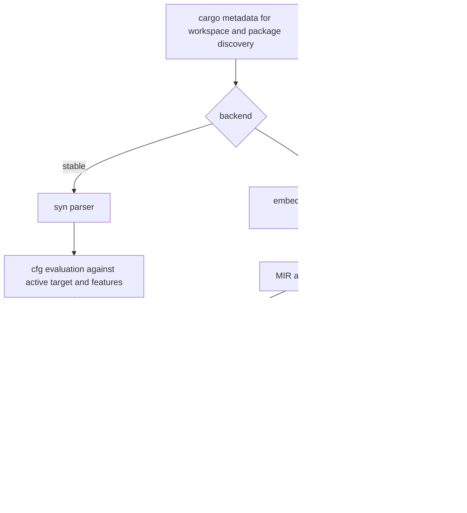

# rusi: Rust Source Inspector

rusi analyzes Rust repositories and emits semantic evidence: packages, files, symbols, imports, security-sensitive API use, a call graph, cryptographic inventory, and practical source-to-sink flows. It is the Rust counterpart to golem, and it feeds cdxgen's Rust evinse output the same way.

## Installation

rusi ships as `rusi-<platform-tuple>` in this repository's packages. To drive it yourself, build from source:

```bash
cd thirdparty/rusi
cargo build --release -p rusi-cli
target/release/rusi analyze --dir /path/to/rust/project --out rusi.json
```

## Quick start

```bash
rusi analyze --dir . --out rusi.json
rusi analyze --dir . --backend stable --callgraph static --dataflow security --out rusi-stable.json
rusi analyze --dir . --backend compiler --toolchain nightly --out rusi-compiler.json
rusi analyze --dir . --callgraph static --callgraph-out callgraph.graphml --callgraph-export-format graphml --out rusi.json
rusi cryptos --dir . --callgraph static --dataflow security --out rusi-cryptos.json
```

Output JSON is minified by default; pass `--pretty` while exploring.

## Two backends, two levels of truth


```mermaid
flowchart TB
  M[cargo metadata for workspace and package discovery] --> S{backend}
  S -->|stable| SY[syn parser]
  SY --> C1[cfg evaluation against active target and features]
  C1 --> R1[imports, decls, usage clues, security signals]
  R1 --> G1[receiver-typed call resolution, deterministic call graph]
  G1 --> D1[interprocedual data flow]
  S -->|compiler| RC[embedded nightly rustc wrapper]
  RC --> H[MIR and HIR evidence]
  H --> R2[type-resolved calls, trait and dyn dispatch metadata]
  R2 --> G2[native interop evidence, richer crypto]
  H --> D2[MIR-informed data flow]
```

The stable backend needs no toolchain beyond a checkout. It follows `mod` declarations from each crate root, honors `#[path]` and inline modules, and evaluates `#[cfg]` against the active target and the features Cargo resolved, so code excluded from this build is not reported and conditional code carries its gate in `cfg_gate`.

Its call resolution is receiver-typed. A call on a known receiver type with no matching local impl is treated as external rather than fanned out to every same-named method, and sink matching uses the receiver type where a bare method name would be ambiguous: `Command::new(..).arg(tainted)` is a process-execution sink, another builder's `arg` is not.

The compiler backend adds an embedded nightly rustc wrapper and MIR/HIR-derived evidence: type-resolved call edges, dispatch metadata for traits and `dyn`, native interop evidence, richer crypto attribution, and MIR-informed flow facts. It trades setup cost for precision.

## Data flow and custom patterns

Flows track environment, CLI, file, and HTTP sources into process execution, filesystem write, read, open, delete and permission, network, SQL, and HTML-response sinks. What the stable backend follows:

- **Sources.** `env::var`/`vars`, `env::args`, stdin, `fs::read*`, and file handles: `File::open(p)` read through `BufReader::new(f).lines()`, or `read_to_string`/`read_to_end` filling an out-parameter. An HTTP handler's extractor parameters are sources whether the type is written in full or imported (`use axum::extract::Query;` then `q: Query<..>`), and whether the parameter is destructured (`Query(params): Query<..>`, `Path(name): Path<String>`).
- **Bindings.** `let`, `if let`, `while let`, `let .. else`, `match` arms, and struct, tuple and slice patterns bind their names from the scrutinee. A destructured name carries the scrutinee's data but not its type, so `Command::Get(cmd) => cmd.apply()` is not resolved as a call on `Command`. Compound assignment (`s += &t`) writes its target, a field write is read back by that field and not its siblings (`c.path = t`), and `&mut self` methods carry their field writes to the caller's receiver (`c.set(t)`, `self.items.push(t)`), through summaries as well.
- **Containers and adapters.** Array literals and `vec!`, `push`/`insert`/`extend` then a read or `pop`, iterator chains (`map`/`filter`/`rev`/`enumerate`/`zip`/`collect`/`join`), `Option`/`Result` plumbing (`ok`, `map_err`, `unwrap_or_else(|| ..)`), `.await`, `&mut` out-parameters, bound closures, and path and string conversions (`PathBuf::from`, `with_extension`, `String::from`). A closure's value reaches a combinator's result through its tail expression, with the closure's own parameters kept apart from same-named outer variables.
- **Globals.** A `static` initializer (`LazyLock::new(|| env::var(..))`, `lazy_static!`), a `OnceLock` setter (`NAME.set(v)`, `NAME.get_or_init(|| ..)`), a write through a lock guard (`*CFG.lock().unwrap() = v`, `LOG.lock().unwrap().push(v)`), a `static mut` assignment, and a `thread_local!` `.with(|c| ..)` closure seed the global for every function that reads it. The reader's source node sits at its read and records the store in its `seededAt` property.
- **Sinks.** `write!`/`writeln!` fire when the writer is typed as a file (`File`, `BufWriter`, `LineWriter`) or a `TcpStream`, never for a `String` buffer or a `fmt::Formatter`, and inline format arguments (`"{secret}"`) count as values. The path-taking `std::fs` calls match the compiler backend's models: `File::create`, `create_dir(_all)`, `copy`, `rename`, `hard_link`, `symlink` and `set_permissions` write, `remove_dir(_all)` deletes, `OpenOptions::open` opens, and `File::open`/`fs::read*` read at a tainted path (`filesystem-read`). A query sink needs a SQL context: a SQL crate in the call, a SQL-named value, or a value built from a SQL-looking `format!` template (`let q = format!("DELETE FROM t WHERE id = {}", t); conn.query_drop(q)`).

The bare HTTP-verb sinks (`get`, `post`, `put`, `patch`, `delete`, `request`) fire only on receivers typed as an HTTP client (`Client`, `Agent`), so a `HashMap::get` lookup is not an outbound request; `send` fires only on a `RequestBuilder` (what `Client::get` and the other verbs start), so a channel sender is not one either. External types are carried through a method chain only by known builder methods (`Command::arg`/`env`/.., `OpenOptions::append`/.., any `*Builder` method, with `build` yielding the built type), so `resp.headers().get(..)` is not typed as the client it came from. The `security` pack is built in; `--deps` extends analysis into dependency crates, and `--dataflow security-deps` keeps dependency bodies so taint can flow through them:

```bash
rusi analyze --dir . --deps --dataflow security-deps --out rusi-deps-taint.json
```

House analysis rules merge with the built-in pack through `--patterns`:

```json
{
  "sources": [
    { "pattern": "mycrate::config::read_key", "category": "custom-source" }
  ],
  "sinks": [
    {
      "pattern": "mycrate::shell::run",
      "category": "custom-command",
      "relevant_arguments": [0]
    }
  ]
}
```

```bash
rusi analyze --dir . --dataflow security --patterns ./rusi-patterns.json --out rusi-custom.json
```

## Crypto inventory

`rusi cryptos` filters the report down to cryptographic evidence for CBOM-style review. Recognized families include sha2, sha1, md5, blake3, aes-gcm, chacha20poly1305, hmac, pbkdf2, argon2, rsa, ed25519-dalek, rustls, and jsonwebtoken. The compiler backend enriches these with type-resolved call sites where the toolchain evidence allows.

## Fan-out control

Call graph construction caps per-call-site candidates to keep pathological dispatch sites from exploding the graph, and says so in a diagnostic. The cap only shapes the emitted call graph: data flow follows every candidate, and neither backend limits how many rounds its fixpoints run, so a flow through a deep call chain, around a loop, or through recursion is followed to the end. [Lesson 9](LESSON9.md) walks the fixtures that pin this, including the loop-carried and recursion-carried flows. `--max-call-candidates 0` lifts the cap when you want the full fan-out and can afford it:

```bash
rusi analyze --dir . --callgraph static --max-call-candidates 0 --out rusi-full.json
```

## What rusi will not tell you

The stable backend resolves calls by receiver type and syntax, not by borrow-checker-grade type inference, so heavily generic or macro-generated dispatch can resolve conservatively. Receiver-typed sinks match the receiver's type by name, not by crate, so a workspace type named `Client` with a `get` method reads as an HTTP client. It is also not path-sensitive: a validation guard (`if !is_valid(&raw) { return }` before a sink) does not suppress the slice, because whether the guard ran is a runtime fact; treat such findings as review candidates. `env::set_var`/`env::remove_var` are reported as `env-mutation` security signals. The compiler backend closes much of that gap but requires a nightly toolchain and speaks only where rustc itself succeeds. Neither backend executes your code, so dynamic dispatch through strings, `eval`-style builders, or process spawning of generated binaries is out of scope.
