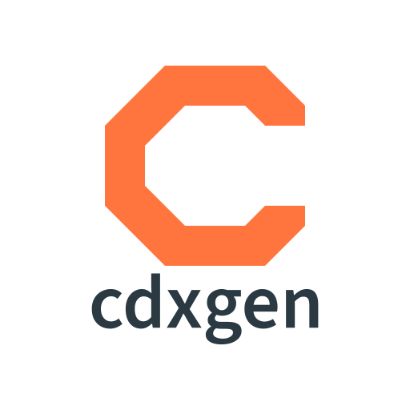

# cdxgen-plugins-bin

> The native half of cdxgen. Nine helper binaries that let a Node.js BOM generator see what only native tooling can see.

[Get Started](README.md) · [Tool Guides](GOLEM.md) · [Architecture](ARCHITECTURE.md) · [Lessons](LESSON1.md)

cdxgen reads source trees, container images, and hosts to produce CycloneDX BOMs. Some evidence cannot come from JavaScript: the Go type checker, Rust's parser and compiler, Swift SourceKit, .NET reflection, APK and DPKG and RPM databases, macOS codesign, Windows Authenticode, live operating system state. This repository builds each of those capabilities as a small native binary, and cdxgen calls the one it needs at scan time.

## The helpers at a glance

[golem](GOLEM.md) maps Go source evidence, call graphs, data flow, API endpoints, and crypto inventory. [rusi](RUSI.md) does the same for Rust. [cdxrs](CDXRS.md) accelerates BOM validation and registry metadata fetch, and [cdxui](CDXUI.md) turns a finished BOM into something a human can browse. [trustinspector](TRUSTINSPECTOR.md) inspects trust anchors, code signing, and host posture, [trivy-cdxgen](TRIVY.md) inventories container and rootfs OS packages, [sourcekitten](SOURCEKITTEN.md) brings Swift semantics, [dosai](DOSAI.md) brings .NET assembly inspection, and [osquery](OSQUERY.md) queries the live operating system.

## Choose your path

### Developers

Run one scan and read the evidence. Start with [golem](GOLEM.md) for Go projects or [rusi](RUSI.md) for Rust projects, then explore the resulting BOM in [cdxui](CDXUI.md). The [lessons](LESSON1.md) walk through each tool with real commands and expected output.

### AppSec teams

Go from inventory to findings. [golem](GOLEM.md) and [rusi](RUSI.md) trace data from sources such as request input and environment variables to sinks such as process execution, and both classify cryptographic APIs for CBOM review. [trustinspector](TRUSTINSPECTOR.md) adds signing and trust-anchor evidence for container and host compliance.

### Platform and compliance teams

Wire the helpers into pipelines. cdxgen resolves the binaries automatically from its npm optional dependencies, and every helper honors a `*_CMD` environment variable for custom builds and air-gapped installs. [trivy-cdxgen](TRIVY.md) covers container inventories, [osquery](OSQUERY.md) covers live hosts, and the [architecture page](ARCHITECTURE.md) explains resolution, fallback, and the provenance manifest.

## Start here

- [What this repository is and how cdxgen uses it](README.md)
- [How helper resolution, packaging, and fallback work](ARCHITECTURE.md)
- [Building and publishing the binaries](BUILD.md)
