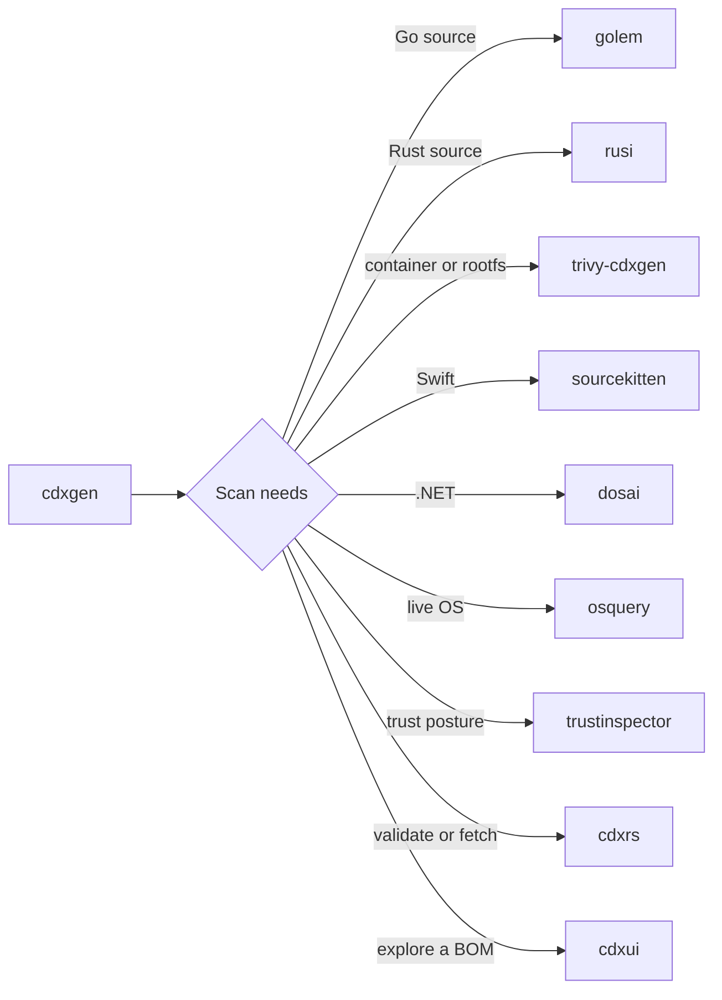

# cdxgen-plugins-bin

> The native half of cdxgen. Semantic analyzers, trust inspectors, and BOM accelerators, shipped as statically linked binaries.

[Architecture](ARCHITECTURE.md) · [Lessons](LESSON1.md) · [Tool guides](README.md)

Nine helpers, one contract: take a project or a host, return compact JSON a Node.js process can merge into a CycloneDX document.
