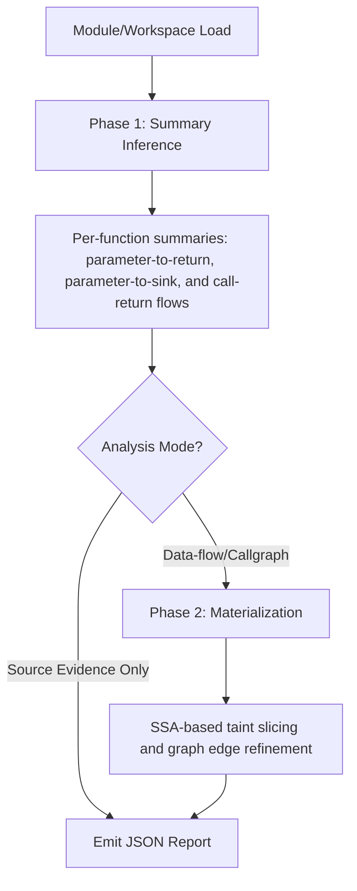

# Golem (Go Library Evidence Mapper)

Golem is a static analyzer for Go source trees. It loads a module or workspace with the Go toolchain, resolves types, and builds SSA (Static Single Assignment) representation when required to write compact JSON reports about code structure, dependencies, call relationships, cryptographic use, and selected data flows.

The analyzer is designed for evidence collection rather than exploit proof. It keeps output small and reviewable by emitting symbols, source locations, package context, module metadata, graph edges, classifications, and summary counts without copying raw secrets or large file contents.

## Analysis Workflow

Golem operates in two distinct phases to balance performance with depth.



### Phase 1: Summary Inference
The engine iterates up to four times to stabilize interprocedural relationships. It builds summaries for parameter-to-return flows, parameter-to-sink flows, and calls that return source values.

### Phase 2: Materialization
When `--dataflow` or `--callgraph` is requested, Golem uses the summaries to perform heavy lifting. It materializes concrete source-to-sink slices and refines graph edges using the SSA representation.

## Capabilities

### Cryptographic Evidence
Evidence is collected during the AST and type-information pass. It is not a full cryptographic protocol verifier but makes crypto-relevant code easy to locate.

* Libraries: Maps imports to crypto families (e.g., `crypto/aes`, `golang.org/x/crypto/*`).
* Symbols: Recognizes security-sensitive API usage (e.g., `crypto/rsa.GenerateKey`, `pbkdf2.Key`).
* TLS Configuration: Inspects literals for `InsecureSkipVerify: true`.
* Material Indicators: Identifies assignments to names that look like keys, tokens, or salts without copying the literal values.

### Data-flow Analysis
Implemented as an SSA-based taint slicer. It uses pattern packs to define sources, sinks, passthroughs, and sanitizers.

* Sources: Environment, CLI, file, and HTTP inputs.
* Sinks: Process execution, filesystem writes, network requests, SQL queries, and HTML responses.
* Sanitizers: Logic to stop traces or remove specific taint kinds (e.g., HTML escaping).

| Option | Default | Purpose |
| :--- | :--- | :--- |
| `--dataflow-max-slices` | 1000 | Limits materialized slices to prevent resource exhaustion. |
| `--dataflow-workers` | 0 | Parallelism control (0 uses all available cores). |
| `--dataflow-skip-generated` | false | Whether to ignore code in generated files. |

## Output Model

The main report is a JSON file.

* `golem-dataflow.json`: Contains the materialized slices and data-flow graphs.
* `golem.json`: The complete structural and evidence report.
* `callgraph.graphml`: The exported call graph.

For a field-by-field JSON reference, see `JSON_ATTRIBUTE_REFERENCE.md`.

## Strengths and Assumptions

### Strengths
* High accuracy for package paths, symbols, and signatures via Go's native type checker.
* Deterministic output suitable for automated comparison and regression testing.
* Low noise via automatic exclusion of external Go module cache paths.

### Assumptions and Limitations
* Static analysis is approximate: absence of evidence is not proof of safety.
* Path and field insensitivity: long or highly branched flows may be truncated by budget limits.
* Dependency on local environment: package loading follows the local Go toolchain and module environment.
* Avoids execution: does not run `go:generate` or evaluate runtime configuration.

## Threat Model

Threat model notes live in `THREAT_MODEL.md`. In short, Golem treats the analyzed repository as untrusted input and avoids copying raw secret values into the report.

## Build and Test

```bash
go test ./...
go build -trimpath -ldflags "-s -w" -o build/golem ./cmd/golem
```

Cross-platform release builds are handled via the Makefile:

```bash
make all
```
