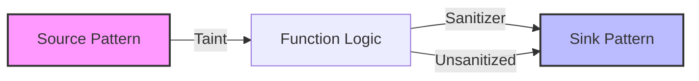

# Rusi (Rust Source Inspector)

Rusi is a Rust code analysis engine designed for semantic evidence collection. It assists downstream reviewers in answering critical supply chain questions regarding package structure, cryptographic usage, and data-flow security.

Rusi is bundled into the `cdxgen` plugin packaging flow but operates as a standalone analyzer with its own CLI, schema, and evaluation harnesses.

## Analysis Backends

Rusi provides two distinct modes of operation, allowing users to trade off speed and safety for depth and fidelity.

| Backend | Method | Risk Profile | Best Use Case |
| :--- | :--- | :--- | :--- |
| **Stable** | AST parsing via `syn` | **Low** | Untrusted repositories; fast, first-pass analysis. |
| **Compiler** | MIR/HIR via `rustc` wrapper | **Medium** | Trusted/Isolated environments; high-fidelity audits. |

### Stable Backend
The default mode is the safest and fastest. It:
* Discovers Rust files from the workspace/package layout.
* Parses source code using the `syn` crate.
* Records imports, declarations, and library usage clues.
* Performs lightweight interprocedural data-flow analysis.
* Emits heuristic crypto/CBOM evidence from syntax-level API usage.

### Compiler Backend
This mode provides higher fidelity by leveraging the actual Rust compiler. It:
* Uses an embedded nightly `rustc` wrapper.
* Provides type-resolved call evidence.
* Includes dispatch metadata (traits, closures, specialization).
* Generates MIR-informed data-flow evidence.
* **Note**: Because it runs `cargo check`, it inherits Cargo's execution semantics (e.g., `build.rs` execution).

## Evidence Collection

### Cryptographic Bill of Materials (CBOM)
Rusi is optimized for CBOM-oriented review. It records four types of evidence:

1. **Libraries**: Crypto-relevant providers (e.g., `sha2`, `rustls`).
2. **Components**: Concrete API usage (e.g., `aes_gcm`, `argon2`).
3. **Materials**: Secret-like identifiers (e.g., keys, salts, nonces) without copying raw values.
4. **Findings**: Review findings like weak primitive usage (e.g., `MD5`).

### Data-flow Analysis
The data-flow engine is pragmatic and uses pattern-driven logic. It identifies:
* **Sources**: Environment, CLI, file, and HTTP inputs.
* **Sinks**: Process execution, filesystem writes, network requests, SQL, and HTML responses.
* **Sanitizers**: Logic that stops traces or removes specific taint kinds (e.g., parameterized SQL APIs).



## Output Model

The primary output is a JSON report containing:
* Workspace modules and packages.
* File-level evidence and flattened imports.
* Optional aggregated crypto evidence.
* Optional call graphs and data-flow traces.

Detailed field descriptions are available in `JSON_ATTRIBUTE_REFERENCE.md`.

## Strengths and Limitations

### Strengths
* Works on stable Rust by default.
* Produces deterministic, review-friendly JSON.
* Offers both safe (stable) and high-fidelity (compiler) modes.
* Ships with integrated evaluation harnesses and regression tests.

### Limitations
* Static analysis is approximate; absence of evidence is not proof of absence.
* Compiler mode is dependent on nightly toolchain availability.
* Data-flow is practical and bounded rather than path-perfect.

## Build and Test

Run workspace tests:
```bash
cargo test --all-targets
```

Build the CLI:
```bash
cargo build -p rusi-cli
cargo build --release -p rusi-cli
```
