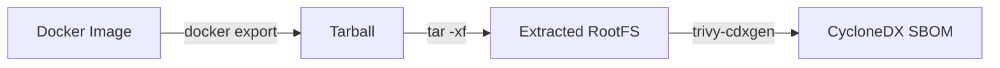

# Trivy Wrapper (cdxgen-optimized)

The Trivy Wrapper is a customized version of [Trivy](https://github.com/aquasecurity/trivy) specifically optimized for integration with `cdxgen`. It provides high-density OS package inventory and provenance metadata for container and rootfs scanning.

Unlike the standard Trivy CLI, this wrapper is designed for automated, non-interactive SBOM enrichment.

## Optimizations for SBOM Enrichment

The wrapper modifies the standard Trivy behavior to better suit the `cdxgen` workflow:

* **Command Limitation**: Exposes only `image`, `rootfs`, and `version` commands to reduce complexity.
* **Output Focus**: Defaults `image` and `rootfs` scans to CycloneDX SBOM output.
* **Operational Rigor**: Forces offline, no-update, and no-progress operation, making it suitable for CI/CD pipelines.
* **Noise Suppression**: Suppresses verbose output unless `--debug` is passed.
* **Language Filtering**: Limits language package collection to Go modules and Go binaries while maintaining full OS package collection.

### Enrichment Features

The wrapper enriches OS package components with high-fidelity metadata:

| Metadata Type | Examples |
| :--- | :--- | :--- |
| **Capability/Provide** | Package capability and provide metadata |
| **Installation Context** | Command names, command paths, and file counts |
| **Provenance** | Package architecture, origin, source, and status |
| **OS Lifecycle** | OS Family, OS Name, OSEOL, and Extended Support status |

When consumed by `cdxgen`, maintainer and vendor trust metadata is automatically promoted into native CycloneDX fields such as `authors` and `manufacturer`.

## Usage

### Scanning a Local RootFS

Generate a CycloneDX SBOM from an unpacked root filesystem:

```bash
./build/trivy-cdxgen-local rootfs --output result.cdx.json /path/to/rootfs
```

### Scanning an Exported Image

To scan an image, export it using Docker, unpack it, and run the wrapper against the extracted rootfs:



```bash
# Example workflow
docker pull alpine:latest
docker create --name "test-container" alpine:latest
docker export "test-container" > "alpine.tar"
tar -xf "alpine.tar" -C "/tmp/alpine-rootfs"
./build/trivy-cdxgen-local rootfs --output alpine-rootfs.cdx.json "/tmp/alpine-rootfs"
docker rm -f "test-container"
```

## Configuration

The behavior of the wrapper can be tuned via environment variables:

* `TRIVY_CDXGEN_INCLUDE_OS_CAPABILITIES`: Controls the emission of `Capability` properties (default: `true`).
* `TRIVY_CDXGEN_INCLUDE_OS_COMMANDS`: Controls the emission of `InstalledCommand` metadata (default: `true`).
* `TRIVY_CDXGEN_INCLUDE_OS_FILES`: Controls the emission of `InstalledFile` properties (default: `true`). 
    * *Note: Enabling this can significantly increase SBOM size on large root filesystems.*

## Build and Test

Build a local test binary from the current directory:

```bash
GOEXPERIMENT=jsonv2 go build -o build/trivy-cdxgen-local .
```
