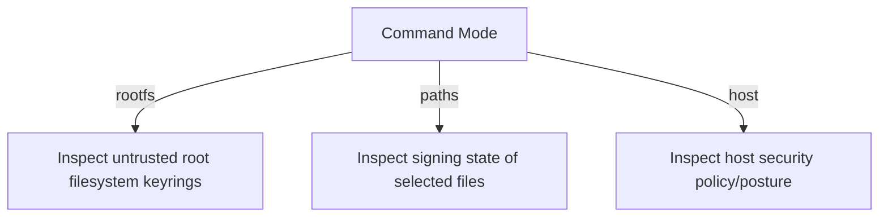

# TrustInspector

TrustInspector is a specialized helper for performing trust-oriented inspection of operating system and root filesystem components. It is designed to provide lightweight, structured JSON evidence for security audits and compliance workflows.

## Capabilities

TrustInspector automates the collection of trust metadata across different platforms and inspection targets.

| Target     | Inspection Type         | Details                                                                                                  |
| :--------- | :---------------------- | :------------------------------------------------------------------------------------------------------- |
| **RootFS** | Keyring/Cert Inspection | Deep inspection of trusted keyring material and CA stores in unpacked root filesystems.                  |
| **Paths**  | Signing/Notarization    | Verification of macOS code-signing/notarization and Windows Authenticode metadata for specific binaries. |
| **Host**   | Posture Assessment      | Inspection of host trust posture, such as Windows WDAC active policies or macOS Gatekeeper status.       |

## Command Modes

The tool is operated via specific command modes that dictate the inspection logic and JSON output shape.



- `trustinspector-cdxgen rootfs <dir>`: Inspects trust anchors within an unpacked root filesystem.
- `trustinspector-cdxgen paths <path> [path...]`: Inspects signing or notarization state for selected application or binary paths.
- `trustinspector-cdxgen host`: Inspects host trust posture (e.g., WDAC, Gatekeeper).

## JSON Output Structure

The tool emits stable, merge-friendly JSON objects. Each invocation returns a single object containing the relevant findings.

### `rootfs` Response Example

Returns a list of `materials` found in the filesystem.

```json
{
  "materials": [
    {
      "kind": "public-key",
      "path": "/usr/share/keyrings/debian-archive-keyring.gpg",
      "name": "debian-archive-keyring.gpg",
      "algorithm": "RSA",
      "trustDomain": "apt"
    }
  ]
}
```

### `paths` Response Example

Returns `inspections` results for the provided paths.

```json
{
  "inspections": [
    {
      "path": "C:\\Windows\\System32\\powershell.exe",
      "properties": [
        { "name": "cdx:windows:authenticode:status", "value": "Valid" }
      ]
    }
  ]
}
```

## Stability and CI

- **Stable Schema**: Top-level keys (`materials`, `inspections`, `hostFindings`) and the `properties` array format are stable.
- **Downstream Consumption**: The tool is optimized for `cdxgen` to ingest findings as metadata.
- **Testing**: The repository includes a Windows smoke test path that validates manifest generation and host/path inspection.

## Implementation Notes

TrustInspector is built to be a lightweight, non-interactive tool. It is intentionally cdxgen-oriented and focuses on emitting merge-friendly JSON rather than full CycloneDX documents.
